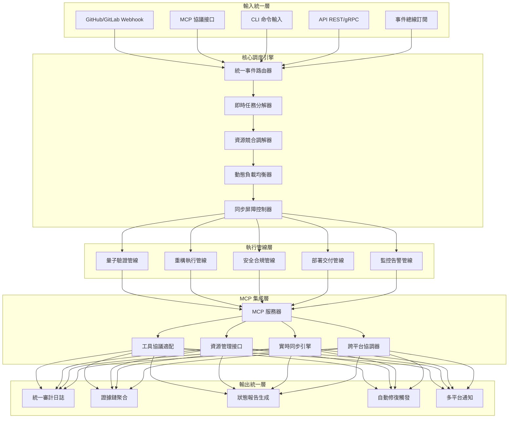

# MachineNativeOps Unified Pipeline & MCP Integration (world_class_validation baseline)

> Note: This subproject holds MCP integration + unified pipeline assets grounded on the world_class_validation baseline. It ships executable YAML manifest, JSON Schema, TypeScript types, and a Python loader.

## Architecture

## Key artifacts
- YAML manifest: `workspace/mcp/pipelines/unified-pipeline-config.yaml`
- JSON Schema: `workspace/mcp/schemas/unified-pipeline.schema.json`
- TypeScript types: `workspace/mcp/types/unifiedPipeline.ts`
- Python loader: `workspace/mcp/tools/load_unified_pipeline.py`

## Quick notes
- JSON Schema can be used in CI for early validation.
- Python loader provides typed access for MCP server integration.
- TypeScript types can be imported directly in MCP tool implementations.
